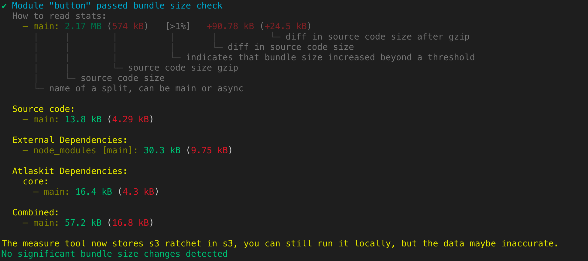

# Atlassian Frontend Measure Tool

The Atlassian Frontend measure tool is effectively a quick script to analyze the webpack bundle for a package. This is incredibly useful both to get the bundle size at-a-glance as well as when doing deep dives into bundle size.

For further details on how we measure the bundle size in Atlassian Frontend, please read this [documentation](https://developer.atlassian.com/cloud/framework/atlassian-frontend/development/performance/00-bundle-size).

## Usage

```
    Usage
        $ measure <[paths]>

      Options
        --analyze               Opens bundle analyzer report
        --entryPoints           Run the tool for each entrypoints per package
        --json                  Outputs measure stats as json
        --lint                  Lint mode fails build if size has been increased beyond threshold (except if used with s3 flag)
        --s3                    Run S3 flow
        --updateSnapshot        Update measure snapshots

      Examples
        $ measure editor-core editor-common
        $ measure editor-core --updateSnapshot
        $ measure editor-core --analyze
        $ measure button badge --entryPoints
```

This prints output just to the terminal which will look like:



As you can see, we have split our code into different chunks to better understand where weight is. Most importantly, you can see if atlassian frontend, the code's own source, or external dependencies are the things weighing the package down.

The ratchet files are now stored into s3.

## Exceptions

It is important to know that we filter out some 'common packages' that are a cost that will be paid by almost everyone using atlaskit. Including these common packages in each output would distort information.

The excluded packages are:

- `react` 5.9kb (2.5kb)
- `react-dom` 96.5kb (30.9kb)
- `styled-components` 43.1kb (16kb)
- `tslib` 5.6kb (2kb)
- `prop-types` 829B (502B)

## A note on this package

The way this package is currently written it is **heavily** tied to the Atlassian Frontend code-base. If you wish to use it elsewhere, we strongly recommend making sure you understand why each piece of the code exists when rolling your own version.
