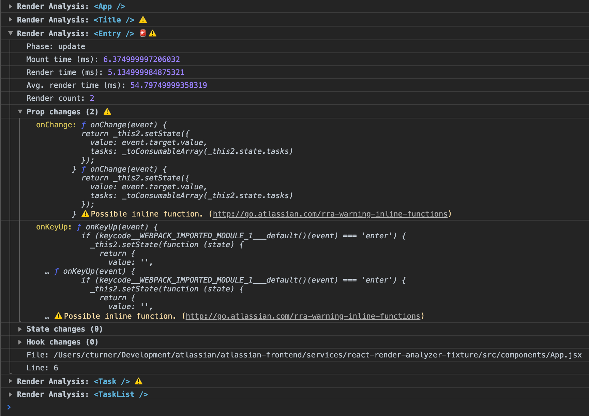

# React Render Analyzer

## Summary

React Render Analyzer, RRA, is a utility to help profile component renders, mounts
and unmounts throughout an application.

## Usage

RRA uses babel and webpack tooling to instrument and patch an application. This allows
precise component identification across builds.

### Instrumentation

Firstly instrument an application with the babel plugin.

```json
{
  "plugins": ["@atlassian/react-render-analyzer/babel"]
}
```

### Applying patches

Next step is to patch your application within webpack.

```json
{
  "entry": ["@atlassian/react-render-analyzer/react-patch", "src/main.js"]
}
```

### Analyzing components

RRA can analyze all component renders within a tree. Simply wrap the component
tree you are interested in with `RenderAnalyzer`.

```js
import React from 'react';
import { render } from 'react-dom';
import { RenderAnalyzer } from 'react-render-analyzer';
import App from './components/App';

render(
  <RenderAnalyzer>
    <App />
  </RenderAnalyzer>,
  document.getElementById('app'),
);
```

Start your application and review the developer console.



RRA will output each component render into collapsed groups. Each output is the
analysis report for the component. It includes the following information:

- Phase (`mount`, `unmount`, `update`)
- Mount time (ms)
- Render time (ms)
- Avg. render time (ms)
- Render count
- Prop changes
- State changes
- Hook changes
- Report: The render report
- File: File location of component _definition_
- Line: Line of component _definition_

#### Warnings

RRA will warn you upon analyzing the render report. You will see the warning emoji (⚠️)
next to component log in the console if this occurs.

There are four types of warnings RRA will identify:

- Forced renders: [go/rra-warning-forced-render](http://go.atlassian.com/rra-warning-forced-render)
- Children are the same: [go/rra-warning-same-children](http://go.atlassian.com/rra-warning-same-children)
- Inline functions: [go/rra-warning-inline-function](http://go.atlassian.com/rra-warning-inline-functions)
- Reference changed: [go/rra-warning-ref-changed](http://go.atlassian.com/rra-warning-ref-changed)

#### Unnecessary renders

Unnecessary renders are when RRA identifies the render was unneeded due to warning cleanups.
Component logs will be faced with the siren emoji (🚨).

#### Render callback

`RenderAnalyzer` accepts a callback for each analysis. This allows developers to write any logic they wish
against the report.

```js
function handleReport(report) {
  if (report.renderCount > 1) {
    console.log('Naughty naughty...');
  }
}

<RenderAnalyzer onRender={handleRender} />;
```

#### Custom logging

By default `RenderAnalyzer` will output every report to the console for you. You can however custom this to suit
the volume of logging or find reports that interest you.

```js
import { logger } from '@atlassain/react-render-analyzer';

function handleRender(report) {
  // only log unnecessary reports or components that take more than 300ms
  if (report.unnecessary || report.renderTime > 300) {
    logger(report);
  }
}

<RenderAnalyzer onRender={handleRender} />;
```

### Non-react analysis

If you don't wish to use `RenderAnalyzer` you can still access the reports programmatically. However, this is only
the report of the render. You will have to run the analysis.

```js
import {
  onReport,
  analyzeReport,
  logger,
} from '@atlassian/react-render-analyzer';

const off = onReport(report => {
  // analyze the report
  const analysis = analyzeReport(report);

  // log to console
  logger(analysis);
});
```

Warning: This will output every single render for EVERY component in your React application. This subscriber will be
invoked using a `requestIdleCallback` so you should not expect reports in real-time.

## Development

### Building

In the repo root run:

```
$ bolt build @atlassian/react-render-analyzer
```

### Fixture application

There is a fixture application to test your changes against and work with. This is located in `services/react-render-analyzer-fixture`. Note: `@atlassian/react-render-analyzer` must first be built before the fixtures app can be tested. To begin testing via the fixtures app run these commands in sequence from the repo root:

```
$ bolt build @atlassian/react-render-analyzer
$ cd services/react-render-analyzer-fixture
$ bolt install
$ bolt start
```
