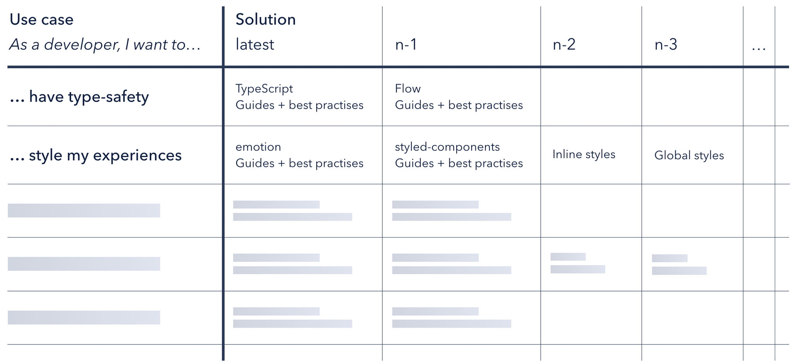
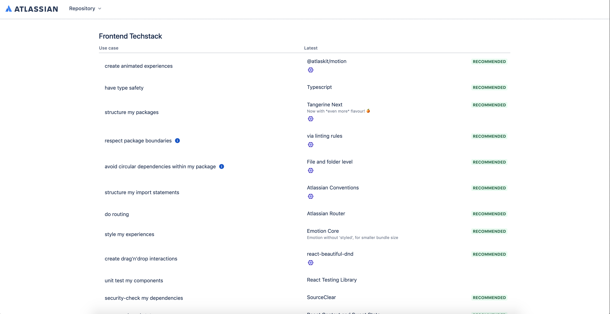
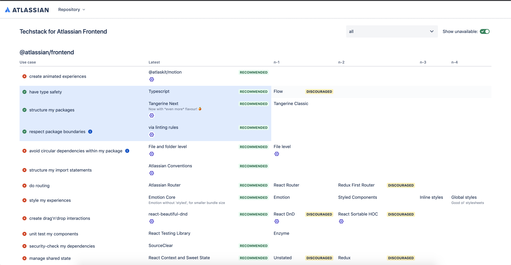

# Preface

As a developer, we vouch for and try adhering to proven solutions, recommendations and patterns for
software development. These recommendation could be in the form of

- books on writing modular code, design patterns etc.
- online blogs or technical documentation
- a PR comment
- an eslint/ stricter rule

While all these options work in isolation and in silos, they all try to help developers write
better, scalable and clean code. In short, it helps developer answer this basic question:

> As a developer, what are the solutions I have for this particular use case? For example, If as a
> developer, I want to ensure type safety, what solutions do we have? The answer could flow
> andtypescript.

And this is how we define a techstack.

> A techstack is a mental model of engineering use-cases and their solutions.



Above table is a representation of how the mapping looks. But only having this visualisation doesn’t
mean we can enforce such mental model. This is why codifying the same is indespensible. Once we
codify, we can ascertain to enforce certain patterns and practices along with being able to
visualize the above table.

# Codifying the 2D Model

Every use case in the table, is represented in the form of an object in Javascript. A sample use
case would look like

```javascript
const packageBoundaries = {
  id: 'package-boundaries',
  caption: {
    'as-a': 'developer',
    'i-want-to': 'respect package boundaries',
  },
  solutions: [linting],
};
```

This object is then a reflection of the first column of any row in the table. The solutions key in
this object is an array of solutions that are available for this use-case. This solution array get
mapped to the rest of the columns in the table for that row. Each column is then a solution and the
preference of using a solution is left to right. Thus, the 0th index element in the solutions array
is the preferred solution for the use-case.

# Understanding Techstack Definitions

An array of such use-cases when exported as a node `package` become a `techstack definition`. So a
`techstack definition` package would have this pattern in their root export.

```javascript
module.exports = [
  animation,
  typeSafety,
  codeStructure,
  packageBoundaries,
  circularDependencies,
  importStructure,
  routing,
  styling,
  dragAndDrop,
  unitTestingComponents,
  securityChecks,
  sharedState,
];
```

Drawing correlation with the table above, each table is thus a techstack definition.

**NOTE**: You need to provide `techstack` as suffix in the package name for techstack definition and
then use the package name without the `techstack` suffix in techstackrc config as mentioned in the
next section.

# Using techstack definitions in the repository

A repository can use multiple use-cases and solutions from multiple techstack definitions since each
techstack definitions might not be self complete in terms of the use-cases and solutions they
provide. For example, Atlassian Frontend uses `@repo/internal` and `@atlassian/frontend` techstack
definitions. Jira uses `@atlassian/jira` techstack definition. All this information regarding the
use-cases, solutions and definitions a repository use, are documented in the root techstackrc.js
config file of the repository. A sample techstackrc looks like:

```javascript
module.exports = {
  config: {
    rootPath: '.',
    eslintConfigPath: '.',
    pathToPackages: 'packages',
    exclusions: ['__fixtures__'],
  },
  repository: {
    '@atlassian/frontend': {
      typing: ['typescript'],
      'code-structure': ['tangerine-next'],
      'package-boundaries': ['linting'],
      'tree-shaking': ['atlassian-conventions'],
      'import-structure': ['atlassian-conventions'],
      'circular-dependencies': ['file-level'],
    },
    '@repo/internal': {
      'tree-shaking': ['no-import-all', 'no-export-all'],
      analytics: ['analytics-next'],
      theming: ['new-theming-api'],
      'ui-components': ['lite-mode'],
      deprecation: ['no-deprecated-imports'],
    },
  },
  default: {
    '@atlassian/frontend': {
      typing: ['typescript'],
      'tree-shaking': ['atlassian-conventions'],
    },
  },
};
```

**NOTE** : A techstack definition `@repo/internal` is mapped to a package named
`@repo/internal-techstack`. Similarly, techstack definition `@atlassian/frontend` is mapped to
package `@atlassian/frontend-techstack`. Thus, if there is a need to create a custom techstack
definition package, you need to suffix it with `techstack` in the package name and then use the
package name with the `techstack` suffix in the techstackrc configuration file.

## Understanding the techstackrc

- **config** : The config key contains meta related info which includes root path, path to
  packages and the excluded list of packages.
- **repository** : The repository key lists the techstack definitions, and the use-cases and their
  solutions used within the repository. It is just a superset to keep track of all the use-cases
  and solutions within the repository.
- **default** : The use-cases and solutions mentioned in the default key are applied by default to
  all the packages.

## Techstack of a package

The use-cases and solutions used by the package can be mentioned in the techstack key of its
package.json. The final solutions which are then applicable to a package is a merge of its own
techstack and the default solutions mentioned in the `default` key of `.techstackrc.js` with the
solutions mentioned in the package.json overriding the default values.

```javascript
Final Techstack Solutions / Package 1 = Merge(...defaultPackageSolutions, OwnPackageSolutions)
```

## Implementing the solutions in a package

The above configuration in `.techstackrc.js` and `techstack` key in package.jsons help enforce the
solutions generated as final techstack solutions for each package.

```javascript
Final Techstack Solutions / Package 1 = Merge(...defaultPackageSolutions, OwnPackageSolutions)
```

Each solution in the solutions array generates an array of checks. Each check resolves to a eslint
or stricter rule. So for every package, we finally get a list of eslint/ stricter rules which need
to be applied to the package.

A sample solution looks like:

```javascript
const dummy = {
  id: 'dummy',
  caption: 'dummy',
  status: 'recommended',
  checks: () => [
    {
      type: 'stricter',
      plugin: '@atlassian/tangerine',
      rule: '@atlassian/tangerine/dummy',
      configuration: {
        level: 'error',
        config: {},
      },
    },
    {
      type: 'eslint',
      rule: 'no-restricted-imports',
      configuration: [
        'error',
        {
          paths: [
            {
              name: 'react',
              message: "Please import React from 'react' instead.",
            },
          ],
        },
      ],
    },
  ],
};
```

Once we have a list of eslint rules/stricter rules, we can then use eslint/ stricter to apply these
rules to the package. This is how we enforce Solutions.

```javascript
olutions → [solution1, solutions2] → [check1, check2, check3, check4] -> [eslintRule1, eslintRule2......, stricterRule1,....]
```

This whole process is handled by another node module package named as
`@atlassian/techstack-runtime`.

> The job of `@atlassian/techstack-runtime` package is to understand the `.techstackrc.js`,
> `techstack` key of each package and then generate a list of eslint and stricter rules. These rules
> are then concatenated in the eslint and stricter configs by the adapters provided by the techstack
> runtime package.

**Note** - For more details on configuring techstack for a repository, read
[configuring techstacks in a repository](./techstacks-configuration-in-repository.md)

# The final part: Techstack Visualisation

The solutions used by repositories and their packages can also be visualised by the techstack
visualisation website. The visualisation website also intends to provide more documented material
for each solution so that anyone picking up some techstack definition understands the
interpretations of a particular solution.

_a. Main page of the techstack visualisation website showing the Atlassian Frontend Definition_


_b. Use cases and solutions used by Atlassian Frontend Monorepo highlighted over the Atlassian
Frontend Techstack Definition_

