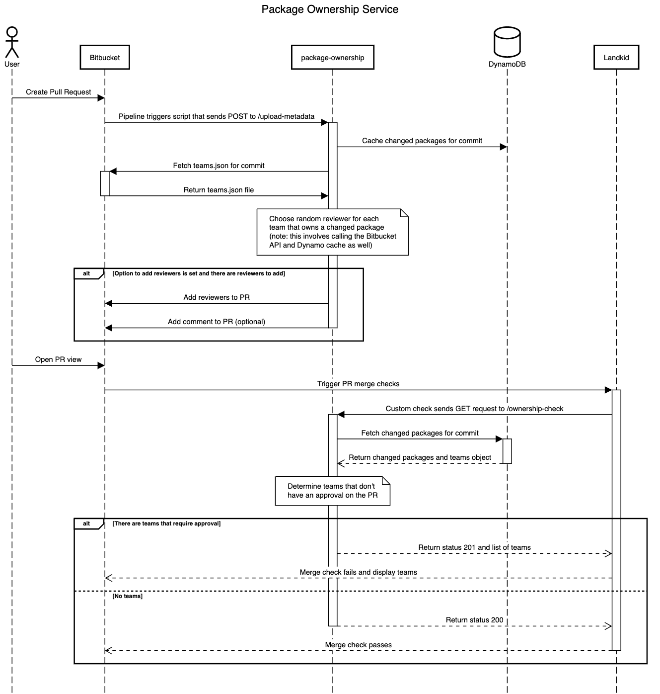

# Package Ownership Lambda

https://microscope.prod.atl-paas.net/services/package-ownership  
https://package-ownership.services.atlassian.com/

## How it works

There are two main functions, initiated by two different endpoints: `upload-metadata` and `ownership-check`.

### Function 1: Upload Metadata

```
POST /upload-metadata

Query String Parameters
  prId: number
  commit: string

Body
  {
    changedPackages: Array<{  // All packages changed in the pull request
      name: string,     // name of package (e.g. @af/package-ownership)
      team?: string,    // team that owns package (e.g. AFP: Monorepo)
    }>,
    addReviewers?: boolean,
    // defaults to random when unspecified.
    reviewerMethod?: 'random' | 'entire-team',
    addComment?: boolean,
  }

Responses
  if malformed request:
    status: 400
  if branch is to be ignored:
    status: 200
    {
      message, // why it was ignored,
    }
  if addReviewers is true:
    if reviewerMethod is 'random':
    status: 201
    {
      message: 'PR metadata cached',
      reviewersAdded: {
        [team: string]: string,  // team to reviewer staff ID
      },
      commentAdded: boolean,
    }
    if reviewerMethod is 'entire-team':
    status: 201
    {
      message: 'PR metadata cached',
      reviewersAdded: {
        [team: string]: [string],  // all the team members will be added as reviewers
      },
      commentAdded: boolean,
    }
  otherwise:
    status: 201
    {
      message: 'PR metadata cached',
    }
```

1. Fetches PR information with `prID` (title, reviewers, author)
2. Stores mapping from PR commit to `changedPackages` in DynamoDB
3. If `addReviewers` flag is set:
   1. Fetches `teams.json` file for PR commit
   2. Determine set of teams that own the changed packages
   3. For each team that doesn't have a reviewer on the PR
      1. Choose random member from contributors list and add them to PR
   4. If `addComment` flag is set:
      1. Add a comment to the PR listing the reviewers added and why
   5. Return information about reviewers and comment (see endpoint responses)

### Function 2: Ownership/Approval Check

```
GET /ownership-check

Query String Parameters
  prId: number
  commit: string

Responses
  if malformed request:
    status: 400
  if branch is to be ignored:
    status: 200
    {
      checkPasses: true,
      message: 'This PR has been ignored due to it's source branch prefix',
    }
  if PR metadata has not been uploaded yet:
    status: 404
    {
      message: 'Required PR metadata is not in cache',
    }
  otherwise:
    status: 200
    {
      checkPassed: boolean,
      teamsRequiringApproval: Array<TeamInfo>,  // Staff IDs are stripped from this
    }
```

1. Fetches PR information with `prId` (approvals, author)
2. Fetches `changedPackages` from DynamoDB using PR commit (requires **Function 1** to have been executed for this PR)
3. Fetches `teams.json` file for PR commit
4. Determine set of teams that own the changed packages
5. Determine list of teams that don't have an approval on the PR
6. Return accordingly (see endpoint responses)

### Authentication

The service requires valid ASAP authentication issued by the service itself. A request to either of the above endpoints that does not have a valid ASAP token will return with `401 Unauthorized`, and a valid token from a different issuer will return with `403 Forbidden`. An existing key that can be used to authenticate requests can be found in the AFP shared Lastpass folder.

## Full flow for a single PR


